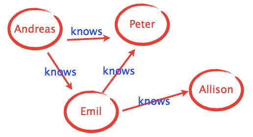

# Cassandra And Neo4J

- Comandos para criação do grafo



```cypher
CREATE (Andreas:Pessoa{nome: 'Andreas'}) - [:KNOWS] -> (Peter:Pessoa{nome: 'Peter'})

CREATE (Emil:Pessoa{nome: 'Emil'}) - [:KNOWS] -> (Allison:Pessoa{nome: 'Allison'})

match (andreas:Pessoa) where andreas.nome = 'Andreas' match (emil:Pessoa) where emil.nome = 'Emil'
CREATE (andreas) - [:KNOWS] -> (emil)

match (peter:Pessoa) where peter.nome = 'Peter' match (emil:Pessoa) where emil.nome = 'Emil'
CREATE (emil) - [:KNOWS] -> (peter)

```
