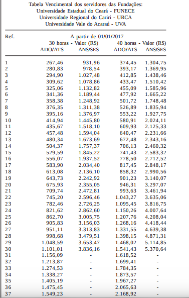

# Tabula

- Foi utilizado um PDF do [Portal da Transparencia](http://transparencia.ce.gov.br/static/modelo-de-governanca/informacoes-servidores) chamado de [Remuneração de 2017](http://transparencia.ce.gov.br/CONTENT/DOCUMENTOS/1462_TabeladeRemunera%C3%A7%C3%A3o2017.pdf).

- Utilizando a ferramenta Tabula para extrair os dados de uma tabela desse arquivo PDF.

- Tabela Utilizada.  

- Arquivo CSV gerado sem cabeçalho.  

  

